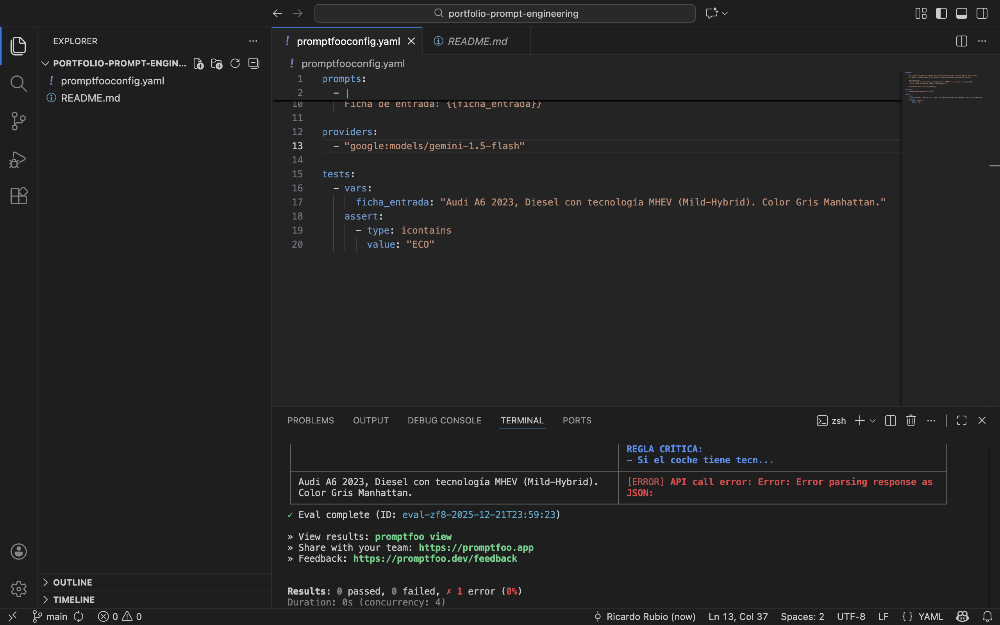
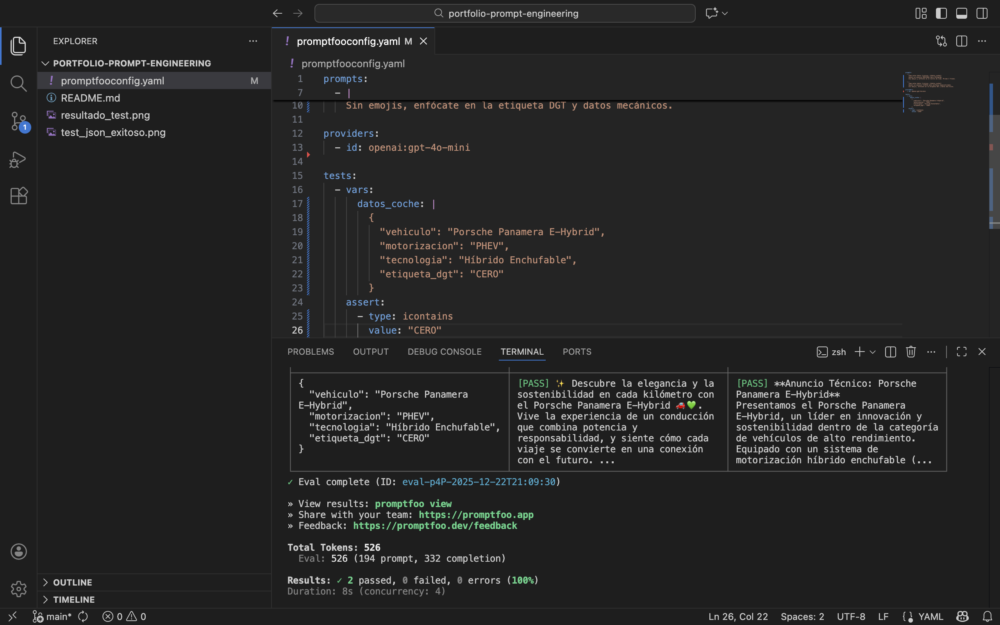

# portfolio-prompt-engineering
# Portfolio: Prompt Engineering - Clasificación DGT

Este proyecto demuestra el uso de un flujo de trabajo profesional para el diseño y validación de prompts complejos, aplicados al sector de automoción.

## 🚀 El Proyecto
Optimización de la clasificación de etiquetas medioambientales (DGT) para un stock de 600 vehículos de alta gama. El sistema identifica automáticamente tecnologías como **MHEV (Mild-Hybrid)** para asignar la etiqueta **ECO** sin errores manuales.

## 🛠 Stack Tecnológico
* **Motor:** OpenAI GPT-4o-mini.
* **Validación:** Promptfoo (Testing automatizado).
* **Control de versiones:** Git & GitHub.

## ✅ Evidencia de éxito
A continuación se muestra el resultado del test de validación donde el prompt clasifica correctamente un Audi A6 MHEV:

## 🚀 Evolución: Extracción Estructurada (JSON Mode)
El proyecto ha evolucionado de generar texto plano a producir datos estructurados listos para integración en sistemas ERP o bases de datos.

### Mejoras implementadas:
* **JSON Mode:** Forzado de respuesta mediante `response_format: { type: "json_object" }` para asegurar la integridad del formato.
* **Validación Robusta:** Implementación de tests de contenido para verificar la lógica de etiquetas DGT (MHEV -> ECO).
* **Eliminación de Ruido:** Limpieza de delimitadores Markdown para permitir el consumo directo de la salida.

*Proyecto desarrollado por Ricardo Rubio Albacete*